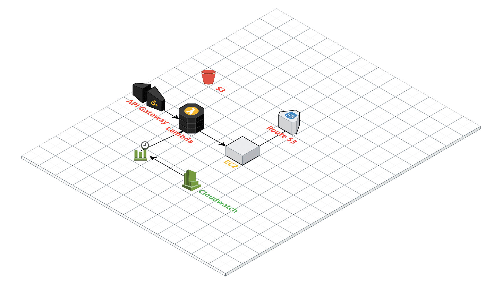

# tf-aws-wow-vanilla-server

> Terraform setup for running wow-vanilla-server application

## Architecture Overview



## Setup

### Credentials

Credentials can be setup in different ways. The modules within this repository either expect the credentials to be available via environment variables or supplied directly to terraform as variables.

```
export AWS_ACCESS_KEY_ID="[acceskey]"
export AWS_SECRET_ACCESS_KEY="[secretkey]"
export AWS_DEFAULT_REGION="eu-central-1"
```

Or directly

```
terraform apply -var 'access_key=[acceskey]' -var 'secret_key=[secretkey]'
```

If none of these are supplied terraform will ask for the variables interactively while preparing the setup

For more details see [documentation](https://www.terraform.io/docs/providers/aws/index.html).

### Deploy

Inside the application folder initialize and then apply the terraform configuration

```
# initialize terraform
terraform init

# check what terraform will create
terraform plan

# create resource
terraform apply
```

### Destroy

```
# destory resource
terraform destroy
```

## Inputs

| Name                            | Description | Type   | Default | Required |
|---------------------------------|-------------|--------|---------|----------|
| access_key                      |             | string | -       | yes      |
| aws_region                      |             | string | -       | yes      |
| docker_instance_name            |             | string | -       | yes      |
| key_name                        |             | string | -       | yes      |
| mysql_app_user                  |             | string | -       | yes      |
| mysql_app_user_password         |             | string | -       | yes      |
| mysql_root_password             |             | string | -       | yes      |
| operator_group                  |             | string | -       | yes      |
| operator_password               |             | string | -       | yes      |
| operator_user                   |             | string | -       | yes      |
| outbound_security_group_name    |             | string | -       | yes      |
| private_ip                      |             | string | -       | yes      |
| secret_key                      |             | string | -       | yes      |
| ssh_security_group_name         |             | string | -       | yes      |
| wow_vanilla_security_group_name |             | string | -       | yes      |

## Outputs

| Name                         | Description                                                |
|------------------------------|------------------------------------------------------------|
| api_gateway_base_url         | The Api Gateway base url                                   |
| api_gateway_start_server_url | The Api Gateway start url                                  |
| api_gateway_stop_server_url  | The Api Gateway stop url                                   |
| availability_zone            | Availability zone of the created instance                  |
| eip_public_ip                | The public Elastic IP address                              |
| generated_ansible_playbook   | The rendered ansible playbook                              |
| generated_cloud_config       | The rendered cloudinit config                              |
| generated_cloud_init_config  | The rendered cloud-init config                             |
| id                           | ID of the created instance                                 |
| key_name                     | Key name of the created instance                           |
| public_ip                    | The public IP of the created ec2 instance                  |
| security_groups              | List of associated security groups of the created instance |
| tags                         | List of tags for the created instance                      |

## Creates

### EC2 Instance

#### Systemd Service

Installs a systemd service `wow-vanilla-server.service`. This service retrieves the newest `mangosd.conf.tpl` and `realmd.conf.tpl` from githubs gists service. When this is done the potential changes are applied to the running docker swarm stack by redeploying.

This means that a change in those configs can be done directly in a gist which is then applied as soon as the ec2 machine is restarting or the systemd service is manually triggered.

### Backup characters database

Creates a script `database-util.sh` in the operators user home directory which allows for easy backup and restoring of the wow characters database.

Basic usage

```
# backup and create dump in the current directory
./database-util.sh backup ./

# restore the characters database
./database-util.sh restore ./[filename].sql
```

**Warning**: Restoring overwrites the current characters database.

### CloudWatch Events

Create event triggers for both starting and stopping the EC2 server.

#### Start server

Starts the server every evening by invoking the Lambda function `RGTFStartStopWoWVanillaServer`.

#### Stop server

Stops the EC2 server at midnight by invoking the Lambda function `RGTFStartStopWoWVanillaServer`.

**Note:** Cloudwatch cron expressions work with GMT time. Times should be adjusted accordingly.

### DNS

Creates an A record for the EC2 server. This has a dependency on a previously created host zone.

`wow-vanilla.ragedunicorn.com - [EIP]`

Dependency on host zone `ragedunicorn.com`

Propagation of a new record can take some time. Test with nslookup:

```
 nslookup wow-vanilla.ragedunicorn.com
 ```

### Lambda

Creates a Lambda function that can start and stop the EC2 server that is running the wow-server. The Lambda function can handle invocation from CloudWatch events and from the Api Gateway.

The Lambda function expects the following input

{
  "action": "", // start or stop
  "region": "eu-central-1",
  "instanceId": "" // instance id of the EC2 instance that gets started or stopped
}

#### Proxy response

The Api Gateway expects a proxy response from the Lambda function.

```
response = {
    "statusCode": 200,
    "body": json.dumps(data),
    "isBase64Encoded": False
};
return response
```

See [AWS documentation](https://aws.amazon.com/premiumsupport/knowledge-center/malformed-502-api-gateway/) for more details about proxy responses.

### API Gateway

Creates an Api for starting and stopping the EC2 instance by invoking the same Lambda function that is also used by CloudWatch.

The invoke url can be found by navigating to:

`https://eu-central-1.console.aws.amazon.com/apigateway/home`

`Choosing the API name > Stages > (Click) wow-vanilla-server`

###### Base URL

`[base-url]/wow-vanilla-server?action=[action]&region=[region]&instanceId=[instance-id]`

###### Start
`[base-url]/wow-vanilla-server?action=start&region=eu-central-1&instanceId=[instance-id]`

###### Stop
`[base-url]/wow-vanilla-server?action=stop&region=eu-central-1&instanceId=[instance-id]`

## Development

### WoW Server configuration

The entrypoint script is getting the `mangosd.conf` and `realmd.conf` directly from github gists and overwrites the configurations inside the docker images by mounting the into the same place as the default configurations. This allows for easy editing inside a gist file. The next time the server starts up the configuration is updated.

For the path to the gist configurations see `templates/instance-entrypoint.tpl`

The gists are using the following pattern:

`https://gist.githubusercontent.com/[gist username]/[gist ID]/raw/[file name]`

The url will always point to the newest revision of the gist.

**Note**: A change might take some time until it actually shows up because of the cache that github is using. Check the urls in a browser to see the actual content.

### Shellscripts

Shellscripts need to have lf set as line ending. Usually this is achieved with a .gitattributes file.

`*.sh text eol=lf`

Because the shellscript in this case (`instance-entrypoint.tpl`) is a template file this rule does not work. It is important that the file does not get commited with crlf line ending.

A shellscript having the wrong linefeed usually results in the following error:

`/bin/bash^M: bad interpreter: No such file or directory`

### Systemd

Is setting up a systemd service `wow-vanilla-server.service` when creating the EC2 instance.

Check logs of service

`sudo journalctl -u wow-vanilla-server.service`

Manual execution of the service

`sudo systemctl start wow-vanilla-server.service`

### User Data

Extra user data can be applied through `user_extra_data` which expects an archive file `user-data.tar.gz`. This archive is created through the `instance-entrypoint.sh` script which is itself part of the `user_data` that AWS defines.

**Note**: User data has some limitations and one can not upload arbitrary data through it.

> User data is limited to 16 KB. This limit applies to the data in raw form, not base64-encoded form.

If any changes need to be done to one of the scripts apply them directly in the files and then package them into `user-data.tar.gz`. This makes sure that the changes are still showing up in code version control.
